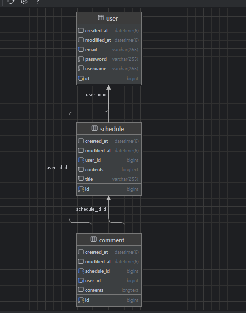

# API 명세서

## comment CRUD(단, 로그인 시 가능)

BaseURL = "/api/schedules/{scheduleId}/comments"

|  기능   | Method |                        URL                        |                 request                 | response |          상태코드           
|:-----:|:------:|:-------------------------------------------------:|:---------------------------------------:|:--------:|:-----------------------:|
| 댓글 등록 |  POST  |              |            body: 댓글생성요청 DTO             |  등록 정보   | 200: 정상등록 <br/> 403: 오류 |
| 댓글 조회 |  GET   | /{commentsId} |                    -         | 단건 응답 정보 | 200: 정상조회 <br/> 404: 오류 
| 목록 조회 |  GET   |              | param: 페이지 번호<br>페이지 크기 | 다건 응답 정보 | 200: 정상조회 <br/> 400: 오류 
| 댓글 수정 |  PUT   | /{commentsId} | body: 일정수정요청 DTO         |  수정 정보   | 200: 정상수정 <br/> 403: 오류 
| 댓글 삭제 | DELETE | /{commentsId} |                    -                    |    -     | 200: 정상삭제 <br/> 403: 오류 

[//]: # (댓글 등록)
<details>
    <summary>댓글 등록</summary>

- 요청 정보
    <table>
      <tr>
        <td ><b>메소드</b></td>
        <td ><b>요청 URL</b></td>
      </tr>
      <tr>
        <td>POST</td>
        <td >/api/schedules/{scheduleId}/comments</td>
      </tr>
    </table>
- 예시
  - 요청: POST /api/schedules/{scheduleId}/comments

  ```json
  {     
        "contents" : "댓글1"
  }
  ```
  - 응답: HTTP/1.1 200 OK

  ```json
  {
        "id" : 1,
        "contents" : "댓글1",
        "createdAt" : "2024-11-15:00:00:00",
        "modifiedAt" : "2024-11-15:00:00:00"
  }
  ```
- 본문
  - 요청
    <table>
          <tr>
            <td ><b>이름</b></td>
            <td ><b>타입</b></td>
            <td ><b>설명</b></td>
            <td ><b>필수</b></td>
          </tr>
          <tr>
            <td ><b>contents</b></td>
            <td ><b>문자열</b></td>
            <td ><b></b></td>
            <td ><b>필수</b></td>
          </tr>
        </table>   
  - 응답
    <table>
          <tr>
            <td ><b>이름</b></td>
            <td ><b>타입</b></td>
            <td ><b>설명</b></td>
            <td ><b>필수</b></td>
          </tr>
          <tr>
            <td ><b>id</b></td>
            <td ><b>int</b></td>
            <td ><b></b></td>
            <td ><b>필수</b></td>
          </tr>
          <tr>
            <td ><b>contents</b></td>
            <td ><b>문자열</b></td>
            <td ><b></b></td>
            <td ><b>필수</b></td>
          </tr>
          <tr>
            <td ><b>createdAt</b></td>
            <td ><b>DATETIME</b></td>
            <td ><b></b></td>
            <td ><b>필수</b></td>
          </tr>
          <tr>
            <td ><b>modifiedAt</b></td>
            <td ><b>DATETIME</b></td>
            <td ><b></b></td>
            <td ><b>필수</b></td>
          </tr>
    </table>   
</details>

[//]: # (목록 조회)
<details>
    <summary>목록 조회</summary>

- 요청 정보
    <table>
      <tr>
        <td ><b>메소드</b></td>
        <td ><b>요청 URL</b></td>
      </tr>
      <tr>
        <td>GET</td>
        <td >/api/schedules/{scheduleId}/comments?pageNumber=XX&pageSize=XX</td>
      </tr>
    </table>
- 예시
  - 요청: GET /api/schedules/{scheduleId}/comments?pageNumber=1&pageSize=2

  - 응답: HTTP/1.1 200 OK

  ```json
  "schedules" : [
    {
        "id" : 1
        "contents" : "댓글1",
        "createdAt" : "2024-11-15",
  },
  {
        "id" : 2
        "contents" : "댓글2",
        "createdAt" : "2024-11-16",
  }
  ]
  
  ```
  
- 본문
  - 요청 x

  - 응답
    <table>
          <tr>
            <td ><b>이름</b></td>
            <td ><b>타입</b></td>
            <td ><b>설명</b></td>
            <td ><b>필수</b></td>
          </tr>
          <tr>
            <td ><b>id</b></td>
            <td ><b>int</b></td>
            <td ><b></b></td>
            <td ><b>필수</b></td>
          </tr>
          <tr>
            <td ><b>contents</b></td>
            <td ><b>문자열</b></td>
            <td ><b></b></td>
            <td ><b>필수</b></td>
          </tr>
          <tr>
            <td ><b>createdAt</b></td>
            <td ><b>DATETIME</b></td>
            <td ><b></b></td>
            <td ><b>필수</b></td>
          </tr>
    </table> 
</details>

[//]: # (단건 조회)
<details>
    <summary>댓글 조회</summary>

- 요청 정보
    <table>
      <tr>
        <td ><b>메소드</b></td>
        <td ><b>요청 URL</b></td>
      </tr>
      <tr>
        <td>GET</td>
        <td >/api/schedules/{scheduleId}/comments/{commentsId}</td>
      </tr>
    </table>
- 예시
  - 요청: GET /api/schedules/1/comments/1

  - 응답: HTTP/1.1 200 OK
  ```json
  {
        "id" : 1
        "contents" : "댓글1",
        "createdAt" : "2024-11-15",
  }
  
  ```
- 본문
  - 요청 x

  - 응답
    <table>
          <tr>
            <td ><b>이름</b></td>
            <td ><b>타입</b></td>
            <td ><b>설명</b></td>
            <td ><b>필수</b></td>
          </tr>
          <tr>
            <td ><b>id</b></td>
            <td ><b>int</b></td>
            <td ><b></b></td>
            <td ><b>필수</b></td>
          </tr>
          <tr>
            <td ><b>contents</b></td>
            <td ><b>문자열</b></td>
            <td ><b></b></td>
            <td ><b>필수</b></td>
          </tr>
          <tr>
            <td ><b>createdAt</b></td>
            <td ><b>DATETIME</b></td>
            <td ><b></b></td>
            <td ><b>필수</b></td>
          </tr>
    </table> 
</details>

[//]: # (댓글 수정)
<details>
    <summary>댓글 수정</summary>

- 요청 정보
    <table>
      <tr>
        <td ><b>메소드</b></td>
        <td ><b>요청 URL</b></td>
      </tr>
      <tr>
        <td>PUT</td>
        <td>/api/schedules/{scheduleId}/comments/{commentsId}</td>
      </tr>
    </table>

- 예시
  - 요청: PUT /api/schedules/1/comments/1
  ```json
  {
        "contents" : "수정 댓글1"
  }
  ```
  - 응답: HTTP/1.1 200 OK
  ```json
  {
        "id" : 1,
        "contents" : "수정 댓글1",
        "modifiedAt" : "2024-11-15"
  }
  ```
- 본문
  - 요청
    <table>
          <tr>
            <td ><b>이름</b></td>
            <td ><b>타입</b></td>
            <td ><b>설명</b></td>
            <td ><b>필수</b></td>
          </tr>
          <tr>
            <td ><b>contents</b></td>
            <td ><b>문자열</b></td>
            <td ><b></b></td>
            <td ><b>필수</b></td>
          </tr>
    </table> 
  - 응답
    <table>
          <tr>
            <td ><b>이름</b></td>
            <td ><b>타입</b></td>
            <td ><b>설명</b></td>
            <td ><b>필수</b></td>
          </tr>
          <tr>
            <td ><b>id</b></td>
            <td ><b>int</b></td>
            <td ><b></b></td>
            <td ><b>필수</b></td>
          </tr>
          <tr>
            <td ><b>contents</b></td>
            <td ><b>문자열</b></td>
            <td ><b></b></td>
            <td ><b>필수</b></td>
          </tr>
          <tr>
            <td ><b>modifiedAt</b></td>
            <td ><b>DATETIME</b></td>
            <td ><b></b></td>
            <td ><b>필수</b></td>
          </tr>
    </table> 
</details>

[//]: # (댓글 삭제)
<details>
    <summary>댓글 삭제</summary>

- 요청 정보
    <table>
      <tr>
        <td ><b>메소드</b></td>
        <td ><b>요청 URL</b></td>
      </tr>
      <tr>
        <td>DELETE</td>
        <td>/api/schedules/{scheduleId}/comments/{commentsId}</td>
      </tr>
    </table>

- 예시
  - 요청: DELETE /api/schedules/1/comments/1

  - 응답: HTTP/1.1 200 OK
</details>

## schedule CRUD(단, 로그인 시 가능)
|    기능    | Method |             URL             |                 request                 | response |          상태코드           
|:--------:|:------:|:---------------------------:|:---------------------------------------:|:--------:|:-----------------------:|
|  일정 등록   |  POST  |       /api/schedules        |            body: 일정생성요청 DTO             |  등록 정보   | 201: 정상등록 <br/> 400: 오류 |
|  일정 조회   |  GET   | /api/schedules/{scheduleId} |                    -                    | 단건 응답 정보 |        200: 정상조회 <br/> 404: 오류
| 일정 목록 조회 |  GET   |  /api/schedules  | param: 페이지 번호<br>페이지 크기<br>작성자명<br>수정날짜 | 다건 응답 정보 |        200: 정상조회 <br/> 400: 오류       
|  일정 수정   |  PUT   | /api/schedules/{scheduleId} |            body: 일정수정요청 DTO             |  수정 정보   |        200: 정상수정 <br/> 406: 오류       
|  일정 삭제   | DELETE | /api/schedules/{scheduleId} |                    -                    |    -     |        200: 정상삭제 <br/> 406: 오류       

[//]: # (일정 등록)
<details>
    <summary>일정 등록</summary>
    
- 요청 정보
    <table>
      <tr>
        <td ><b>메소드</b></td>
        <td ><b>요청 URL</b></td>
      </tr>
      <tr>
        <td>POST</td>
        <td >/api/schedules</td>
      </tr>
    </table>
- 예시
  - 요청: POST /api/schedules

  ```json
  {     
        "title" : "일정제목",
        "contents" : "일정내용"
  }
  ```
  - 응답: HTTP/1.1 201 Created

  ```json
  {
        "scheduleId" : 3,
        "title" : "일정제목",
        "contents" : "일정내용",
        "createdAt" : "2024-11-13"
  }
  ```
- 본문 
  - 요청
    <table>
          <tr>
            <td ><b>이름</b></td>
            <td ><b>타입</b></td>
            <td ><b>설명</b></td>
            <td ><b>필수</b></td>
          </tr>
          <tr>
            <td ><b>title</b></td>
            <td ><b>문자열</b></td>
            <td ><b></b></td>
            <td ><b>필수</b></td>
          </tr>
          <tr>
            <td ><b>contents</b></td>
            <td ><b>문자열</b></td>
            <td ><b></b></td>
            <td ><b>필수</b></td>
          </tr>
        </table>   
  - 응답
    <table>
          <tr>
            <td ><b>이름</b></td>
            <td ><b>타입</b></td>
            <td ><b>설명</b></td>
            <td ><b>필수</b></td>
          </tr>
          <tr>
            <td ><b>scheduleId</b></td>
            <td ><b>int</b></td>
            <td ><b></b></td>
            <td ><b>필수</b></td>
          </tr>
          <tr>
            <td ><b>title</b></td>
            <td ><b>문자열</b></td>
            <td ><b></b></td>
            <td ><b>필수</b></td>
          </tr>
          <tr>
            <td ><b>contents</b></td>
            <td ><b>문자열</b></td>
            <td ><b></b></td>
            <td ><b>필수</b></td>
          </tr>
          <tr>
            <td ><b>createdAt</b></td>
            <td ><b>문자열->DATETIME</b></td>
            <td ><b></b></td>
            <td ><b>필수</b></td>
          </tr>
    </table>   
</details>

[//]: # (일정 목록 조회)
<details>
    <summary>일정 목록 조회</summary>

- 요청 정보
    <table>
      <tr>
        <td ><b>메소드</b></td>
        <td ><b>요청 URL</b></td>
      </tr>
      <tr>
        <td>GET</td>
        <td >/api/schedules?pageNumber=XX&pageSize=XX&&writer=XX&date=XX</td>
      </tr>
    </table>
- 예시
  - 요청: GET /api/schedules?pageNumber=1&pageSize=2

  - 응답: HTTP/1.1 200 OK

  ```json
  "schedules" : [
    {
        "title" : "일정제목1",
        "contents" : "일정내용1" 
        "totalComments" : 5,
        "createdAt" : "2024-10-31",
        "modifiedAt" : "2024-11-14",
        "username" : "홍길동"
  },
  {
        "title" : "일정제목2",
        "contents" : "일정내용2" 
        "totalComments" : 3,
        "createdAt" : "2024-10-31",
        "modifiedAt" : "2024-11-13",
        "username" : "홍길동"
  }]
  
  ```
- 본문
  - 요청 x
    
  - 응답
    <table>
          <tr>
            <td ><b>이름</b></td>
            <td ><b>타입</b></td>
            <td ><b>설명</b></td>
            <td ><b>필수</b></td>
          </tr>
          <tr>
            <td ><b>title</b></td>
            <td ><b>문자열</b></td>
            <td ><b></b></td>
            <td ><b>필수</b></td>
          </tr>
          <tr>
            <td ><b>contents</b></td>
            <td ><b>문자열</b></td>
            <td ><b></b></td>
            <td ><b>필수</b></td>
          </tr>
          <tr>
            <td ><b>totalComments</b></td>
            <td ><b>int</b></td>
            <td ><b></b></td>
            <td ><b>필수</b></td>
          </tr>
          <tr>
            <td ><b>createdAt</b></td>
            <td ><b>DATETIME</b></td>
            <td ><b></b></td>
            <td ><b>필수</b></td>
          </tr>
          <tr>
            <td ><b>modifiedAt</b></td>
            <td ><b>DATETIME</b></td>
            <td ><b></b></td>
            <td ><b>필수</b></td>
          </tr>
          <tr>
            <td ><b>username</b></td>
            <td ><b>문자열</b></td>
            <td ><b></b></td>
            <td ><b>필수</b></td>
          </tr>
    </table> 
</details>

[//]: # (일정 단건 조회)
<details>
    <summary>일정 단건 조회</summary>

- 요청 정보
    <table>
      <tr>
        <td ><b>메소드</b></td>
        <td ><b>요청 URL</b></td>
      </tr>
      <tr>
        <td>GET</td>
        <td >/api/schedules/{scheduleId}</td>
      </tr>
    </table>
- 예시
    - 요청: GET /api/schedules/2

    - 응답: HTTP/1.1 200 OK
  ```json
  {
        "title" : "일정제목2",
        "contents" : "일정내용2" 
        "totalComments" : 3,
        "createdAt" : "2024-10-31",
        "modifiedAt" : "2024-11-13",
        "username" : "홍길동"
  }
  
  ```
- 본문
  - 요청 x

  - 응답
    <table>
          <tr>
            <td ><b>이름</b></td>
            <td ><b>타입</b></td>
            <td ><b>설명</b></td>
            <td ><b>필수</b></td>
          </tr>
          <tr>
            <td ><b>title</b></td>
            <td ><b>문자열</b></td>
            <td ><b></b></td>
            <td ><b>필수</b></td>
          </tr>
          <tr>
            <td ><b>contents</b></td>
            <td ><b>문자열</b></td>
            <td ><b></b></td>
            <td ><b>필수</b></td>
          </tr>
          <tr>
            <td ><b>totalComments</b></td>
            <td ><b>int</b></td>
            <td ><b></b></td>
            <td ><b>필수</b></td>
          </tr>
          <tr>
            <td ><b>createdAt</b></td>
            <td ><b>DATETIME</b></td>
            <td ><b></b></td>
            <td ><b>필수</b></td>
          </tr>
          <tr>
            <td ><b>modifiedAt</b></td>
            <td ><b>DATETIME</b></td>
            <td ><b></b></td>
            <td ><b>필수</b></td>
          </tr>
          <tr>
            <td ><b>username</b></td>
            <td ><b>문자열</b></td>
            <td ><b></b></td>
            <td ><b>필수</b></td>
          </tr>
    </table> 
</details>

[//]: # (일정 수정)
<details>
    <summary>일정 수정</summary>

- 요청 정보
    <table>
      <tr>
        <td ><b>메소드</b></td>
        <td ><b>요청 URL</b></td>
      </tr>
      <tr>
        <td>PUT</td>
        <td>/api/schedules/{scheduleId}</td>
      </tr>
    </table>
  
- 예시
    - 요청: PUT /api/schedules/{scheduleId}
  ```json
  {
        "title" : "수정된 일정 제목2",
        "contents" : "수정된 일정 내용2"
  }
  ```
    - 응답: HTTP/1.1 200 OK
  ```json
  {
        "scheduleId" : 2,
        "title" : "수정된 일정 제목2",
        "contents" : "수정된 일정 내용2"
        "modifiedAt" : "2024-11-15"
  }
  ```
- 본문
  - 요청 
    <table>
          <tr>
            <td ><b>이름</b></td>
            <td ><b>타입</b></td>
            <td ><b>설명</b></td>
            <td ><b>필수</b></td>
          </tr>
          <tr>
            <td ><b>title</b></td>
            <td ><b>문자열</b></td>
            <td ><b></b></td>
            <td ><b>필수</b></td>
          </tr>
          <tr>
            <td ><b>contents</b></td>
            <td ><b>문자열</b></td>
            <td ><b></b></td>
            <td ><b>필수</b></td>
          </tr>
    </table> 
  - 응답
    <table>
          <tr>
            <td ><b>이름</b></td>
            <td ><b>타입</b></td>
            <td ><b>설명</b></td>
            <td ><b>필수</b></td>
          </tr>
          <tr>
            <td ><b>scheduleId</b></td>
            <td ><b>int</b></td>
            <td ><b></b></td>
            <td ><b>필수</b></td>
          </tr>
          <tr>
            <td ><b>title</b></td>
            <td ><b>문자열</b></td>
            <td ><b></b></td>
            <td ><b>필수</b></td>
          </tr>
          <tr>
            <td ><b>contents</b></td>
            <td ><b>문자열</b></td>
            <td ><b></b></td>
            <td ><b>필수</b></td>
          </tr>    
          <tr>
            <td ><b>modifiedAt</b></td>
            <td ><b>DATETIME</b></td>
            <td ><b></b></td>
            <td ><b>필수</b></td>
          </tr>
    </table> 
</details>

[//]: # (일정 삭제)
<details>
    <summary>일정 삭제</summary>

- 요청 정보
    <table>
      <tr>
        <td ><b>메소드</b></td>
        <td ><b>요청 URL</b></td>
      </tr>
      <tr>
        <td>DELETE</td>
        <td>/api/schedules/{scheduleId}</td>
      </tr>
    </table>

- 예시
    - 요청: DELETE /api/schedules/13

    - 응답: HTTP/1.1 200 OK
</details>

## user CRUD
|  기능   | Method |         URL         |     request      | response |           상태코드           
|:-----:|:------:|:-------------------:|:----------------:|:--------:|:------------------------:|
| 유저 가입 |  POST  |  /api/users/signup  | body: 유저생성요청 DTO |  작성자 정보  | 201: 정상등록 <br/> 400: 오류  |
|  로그인  |  POST  |  /api/users/login   |  body: 로그인 DTO   |  작성자 정보  | 200: 정상로그인 <br/> 400: 오류 |
| 유저 조회 |  GET   | /api/users/{userId} |        -         |  작성자 정보  | 200: 정상조회 <br/> 404: 오류  
| 유저 수정 |  PUT   |     /api/users      | body: 유저수정요청 DTO |  수정된 정보  | 200: 정상조회 <br/> 406: 오류  
| 유저 삭제 | DELETE |     /api/users      |        -         |    -     |     200: 정상삭제 <br/>      
| 로그 아웃 | GET |  /api/users/logout  |        -         | - |       200: 정상 로그아웃       |

[//]: # (유저 등록)
<details>
    <summary>유저 가입</summary>

- 요청 정보
    <table>
      <tr>
        <td ><b>메소드</b></td>
        <td ><b>요청 URL</b></td>
      </tr>
      <tr>
        <td>POST</td>
        <td >/api/users/signup</td>
      </tr>
    </table>
- 예시
    - 요청: POST /api/users/signup

  ```json
  {     
        "email" : "a@b.com",
        "username" : "홍길동",
        "password" : "1234"
  }
  ```
    - 응답: HTTP/1.1 201 Created

  ```json
  {
        "userId" : 1,
        "email" : "a@b.com",
        "username" : "홍길동",
        "createdAt" : "2024-11-15"
  }
  ```
- 본문
  - 요청
    <table>
          <tr>
            <td ><b>이름</b></td>
            <td ><b>타입</b></td>
            <td ><b>설명</b></td>
            <td ><b>필수</b></td>
          </tr>
          <tr>
            <td ><b>email</b></td>
            <td ><b>문자열</b></td>
            <td ><b></b></td>
            <td ><b>필수</b></td>
          </tr>
          <tr>
            <td ><b>username</b></td>
            <td ><b>문자열</b></td>
            <td ><b></b></td>
            <td ><b>필수</b></td>
          </tr>
          <tr>
            <td ><b>password</b></td>
            <td ><b>문자열</b></td>
            <td ><b></b></td>
            <td ><b>필수</b></td>
          </tr>    
    </table>  
  - 응답
    <table>
          <tr>
            <td ><b>이름</b></td>
            <td ><b>타입</b></td>
            <td ><b>설명</b></td>
            <td ><b>필수</b></td>
          </tr>
          <tr>
            <td ><b>userId</b></td>
            <td ><b>int</b></td>
            <td ><b></b></td>
            <td ><b>필수</b></td>
          </tr>
          <tr>
            <td ><b>email</b></td>
            <td ><b>문자열</b></td>
            <td ><b></b></td>
            <td ><b>필수</b></td>
          </tr>
          <tr>
            <td ><b>username</b></td>
            <td ><b>문자열</b></td>
            <td ><b></b></td>
            <td ><b>필수</b></td>
          </tr>
          <tr>
            <td ><b>createdAt</b></td>
            <td ><b>DATETIME</b></td>
            <td ><b></b></td>
            <td ><b>필수</b></td>
          </tr>
    </table>  
</details>

<details>
    <summary>유저 로그인</summary>

- 요청 정보
    <table>
      <tr>
        <td ><b>메소드</b></td>
        <td ><b>요청 URL</b></td>
      </tr>
      <tr>
        <td>POST</td>
        <td >/api/users/login</td>
      </tr>
    </table>
- 예시
  - 요청: POST /api/users/login

  ```json
  {     
        "email" : "a@b.com",
        "password" : "1234"
  }
  ```
  - 응답: HTTP/1.1 200 OK

- 본문
  - 요청
    <table>
          <tr>
            <td ><b>이름</b></td>
            <td ><b>타입</b></td>
            <td ><b>설명</b></td>
            <td ><b>필수</b></td>
          </tr>
          <tr>
            <td ><b>email</b></td>
            <td ><b>문자열</b></td>
            <td ><b></b></td>
            <td ><b>필수</b></td>
          </tr>
          <tr>
            <td ><b>password</b></td>
            <td ><b>문자열</b></td>
            <td ><b></b></td>
            <td ><b>필수</b></td>
          </tr>    
    </table>  
  - 응답: HTTP/1.1 200 OK
</details>

[//]: # (유저 조회)
<details>
    <summary>유저 단건 조회</summary>

- 요청 정보
    <table>
      <tr>
        <td ><b>메소드</b></td>
        <td ><b>요청 URL</b></td>
      </tr>
      <tr>
        <td>GET</td>
        <td >/api/users/{userId}</td>
      </tr>
    </table>
- 예시
    - 요청: GET /api/writers/1

    - 응답: HTTP/1.1 200 OK
  
  ```json
  {
        "userId" : 1,
        "email" : "a@b.com",
        "username" : "홍길동"
  }
  ```
- 본문
  - 요청 x
  - 응답
    <table>
          <tr>
            <td ><b>이름</b></td>
            <td ><b>타입</b></td>
            <td ><b>설명</b></td>
            <td ><b>필수</b></td>
          </tr>
          <tr>
            <td ><b>userId</b></td>
            <td ><b>int</b></td>
            <td ><b></b></td>
            <td ><b>필수</b></td>
          </tr>
          <tr>
            <td ><b>email</b></td>
            <td ><b>문자열</b></td>
            <td ><b></b></td>
            <td ><b>필수</b></td>
          </tr>
          <tr>
            <td ><b>username</b></td>
            <td ><b>문자열</b></td>
            <td ><b></b></td>
            <td ><b>필수</b></td>
          </tr>
    </table>  
</details>

[//]: # (유저 수정)
<details>
    <summary>유저 수정</summary>

- 요청 정보
    <table>
      <tr>
        <td ><b>메소드</b></td>
        <td ><b>요청 URL</b></td>
      </tr>
      <tr>
        <td>PUT</td>
        <td>/api/users</td>
      </tr>
    </table>

- 예시
    - 요청: PUT /api/users
  ```json
  {
        "email": "b@c.com", -> 수정된 이메일
        "username" : "김길동" -> 수정된 이름
  }
  ```
    - 응답: HTTP/1.1 200 OK
  ```json
  {
        "userId" : 1,
        "email": "b@c.com",
        "username" : "아무개1",
        "modifiedAt" : "2024-11-15"
  }
  ```
- 본문
  - 요청
    <table>
          <tr>
            <td ><b>이름</b></td>
            <td ><b>타입</b></td>
            <td ><b>설명</b></td>
            <td ><b>필수</b></td>
          </tr>
          <tr>
            <td ><b>email</b></td>
            <td ><b>문자열</b></td>
            <td ><b></b></td>
            <td ><b>필수</b></td>
          </tr>
          <tr>
            <td ><b>username</b></td>
            <td ><b>문자열</b></td>
            <td ><b></b></td>
            <td ><b>필수</b></td>
          </tr>
        </table>   
  - 응답
    <table>
          <tr>
            <td ><b>이름</b></td>
            <td ><b>타입</b></td>
            <td ><b>설명</b></td>
            <td ><b>필수</b></td>
          </tr>
          <tr>
            <td ><b>userId</b></td>
            <td ><b>int</b></td>
            <td ><b></b></td>
            <td ><b>필수</b></td>
          </tr>
          <tr>
            <td ><b>email</b></td>
            <td ><b>문자열</b></td>
            <td ><b></b></td>
            <td ><b>필수</b></td>
          </tr>
          <tr>
            <td ><b>username</b></td>
            <td ><b>문자열</b></td>
            <td ><b></b></td>
            <td ><b>필수</b></td>
          </tr>
          <tr>
            <td ><b>modifiedAt</b></td>
            <td ><b>DATETIME</b></td>
            <td ><b></b></td>
            <td ><b>필수</b></td>
          </tr>
    </table>  
</details>

[//]: # (유저 삭제)

<details>
    <summary>유저 삭제</summary>

- 요청 정보
    <table>
      <tr>
        <td ><b>메소드</b></td>
        <td ><b>요청 URL</b></td>
      </tr>
      <tr>
        <td>DELETE</td>
        <td>/api/users</td>
      </tr>
    </table>

- 예시
    - 요청: DELETE /api/users
    - 응답: HTTP/1.1 200 OK
</details>


[//]: # (로그 아웃)
<details>
    <summary>로그 아웃</summary>

- 요청 정보
    <table>
      <tr>
        <td ><b>메소드</b></td>
        <td ><b>요청 URL</b></td>
      </tr>
      <tr>
        <td>GET</td>
        <td>/api/users/logout</td>
      </tr>
    </table>

- 예시
  - 요청: GET /api/users
  - 응답: HTTP/1.1 200 OK
</details>

# ERD

---




